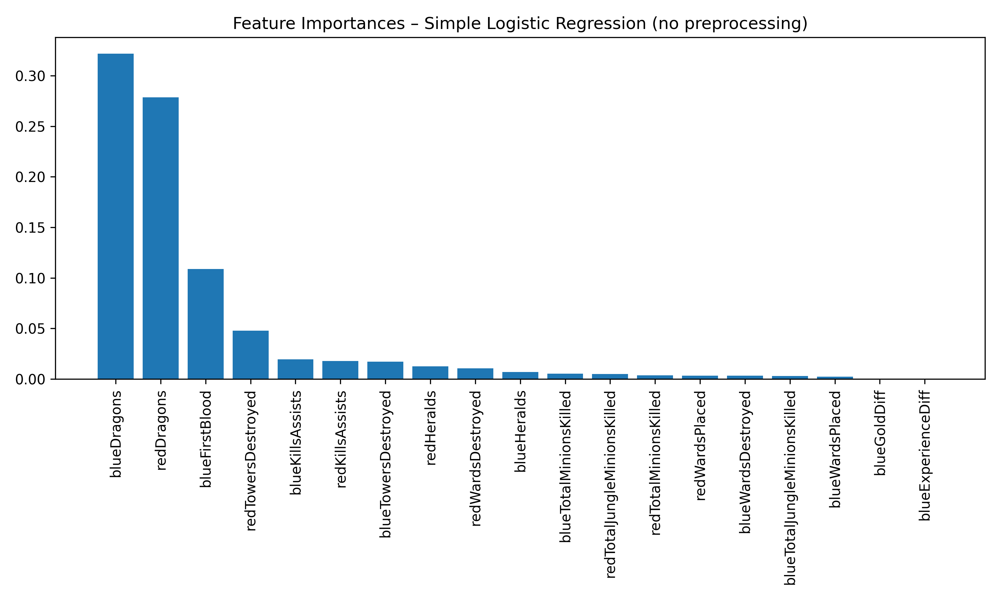

# League of Legends Win Prediction with 10mn in-game stats

<p align="center">
  
</p>

This repository contains my **first end-to-end machine learning project** on real game data.  
The goal is to predict whether the **blue side** will win a League of Legends match using the game state after ~10 minutes (objectives, kills, towers, etc.).
The dataset consists of game data from high-elo players, which makes the outcomes of the games less random.

Because this is a **learning / showcase project**, the notebook also shows my thought process: I try things, compare models, leave a few alternative attempts, and I don’t over-polish every cell like I would for a school assignment. The idea is to show **how I would tackle an ML problem from scratch**, not just the final answer.

---

## Dataset & Objective

- **Source:** League of Legends match data (structured similarly to Riot’s Match-V5 output).
- **Unit of prediction:** one match.
- **Target:** `blue_win` (`1` if blue team wins, `0` otherwise).
- **Features:** 10-minute game stats such as:
  - number of dragons taken
  - towers destroyed
  - first blood
  - kills/assists
  - blue vs red differences

The intuition: after 10 minutes, the game state already contains a lot of signal about who will win.

---

## Approach

1. **Data loading & cleaning** — load the CSV / match data, remove obviously post-game features.
2. **Feature engineering** — create meaningful features (e.g. `gold_diff`, `towers_diff`, objective counts).
3. **Baselines** — start with a simple Logistic Regression to get a reference.
4. **Better models** — try tree-based models (RandomForest / XGBoost).
5. **Evaluation** — accuracy, ROC-AUC, and feature importance to understand what the model learns.

I kept intermediate steps in the notebook to show the progression.

---

## Example Result from the best model

| Model | Accuracy | ROC-AUC |
|--------|-----------|----------|
| Logistic Regression | **0.72** | **0.79** |

---

## How to Run Locally

```bash
git clone https://github.com/4LEC212/lol-win-prediction-10mn.git
cd lol-win-prediction-10mn
pip install -r requirements.txt
jupyter notebook LoL_win_predict.ipynb